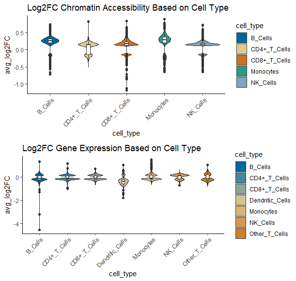
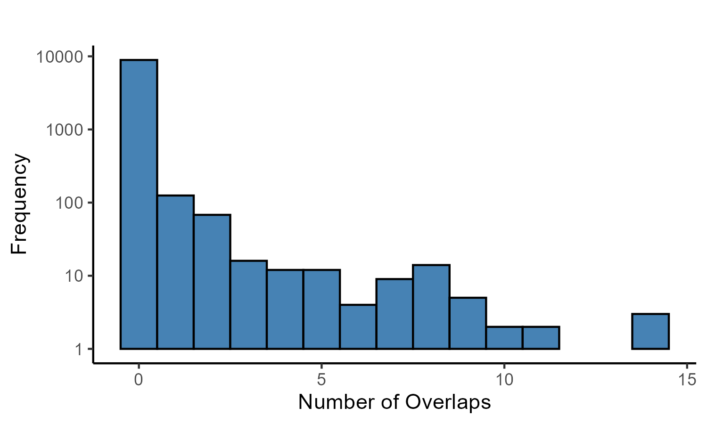
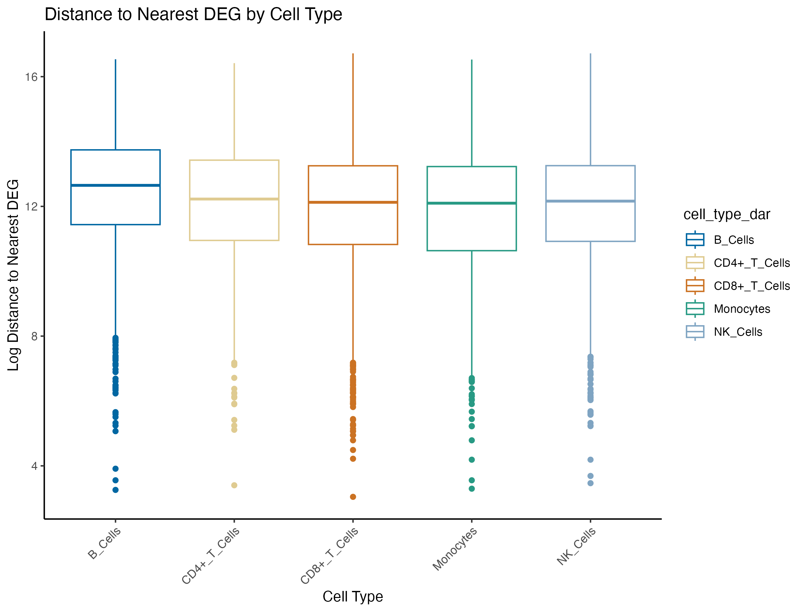
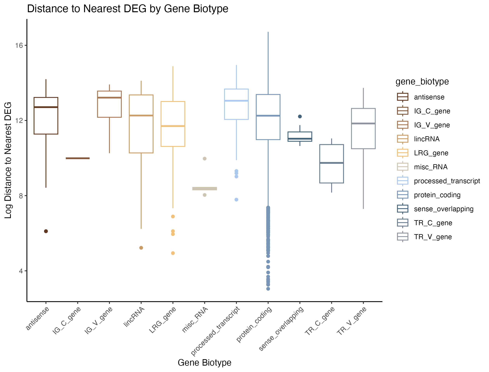
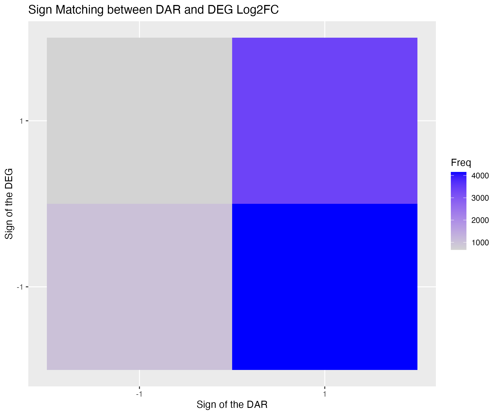

  
```{r setup, include=FALSE}
knitr::opts_chunk$set(echo = TRUE)
```

```{r, echo=FALSE, results='hide',warning=FALSE}
suppressPackageStartupMessages({library(dplyr)
  library(knitr)})
```


## Project Motivation and Background

This project builds on insights from "Epigenetic Dysregulation in Alzheimer’s Disease Peripheral Immunity" (2024, Ramakrishnan), which utilized single cell assay of transposable accessible chromatin sequencing (scATAC-seq) and single cell RNA sequencing (scRNA-seq) to investigate transcriptional and chromatin accessibility changes in the peripheral immune system of Alzheimer’s disease (AD) patients compared to healthy controls (HC). The study identified significant increases in chromatin accessibility in peripheral immune cells of AD patients, with a focus on the APOE gene (APO lipoprotein E), a key risk gene for AD with three isoforms: APOE2, APOE3, and APOE4. The authors provided a list of differentially expressed genes (DEGs), their log2 fold changes, and overlaps between DEGs and differentially accessible regions (DARs).

Single-cell multiomic (multiple biological measurements from the same cell) analyses, particularly those utilizing scATAC-seq, remain a field without standard data processing pipelines and steps. Thus these data present a unique opportunity to learn exploratory analysis techniques for linking chromatin state to transcriptional activity in immune cells at single-cell resolution.

Our study extends the scope of Ramakrishnan et al. by systematically quantifying the spatial relationship between DARs and DEGs across all immune cell types. Specifically, we aim to expand upon the reported binary overlap results by measuring distances between DARs and the nearest DEG promoters. Additionally, we explore correlations between gene regulation patterns and cell types to identify potential trends linking DAR proximity, gene type, and immune cell identity.


## Data Analysis Methods

### Data Preparation 

We began our analysis by obtaining the processed differentially accessible regions (DARs) and differentially expressed genes (DEGs) datasets provided by Ramakrishnan et al. (2024). These datasets included chromatin accessibility and gene expression changes identified between Alzheimer's disease (AD) patients and healthy controls (HC) across multiple immune cell types. 

In the original study, differential expression analysis was performed using Model-based Analysis of Single-cell Transcriptomics (MAST), a statistical method that models both the probability of expression and the level of expression for each gene in single-cell RNA sequencing data. For identifying DARs from single-cell ATAC-seq data, the authors employed single-cell logistic regression (LR), which models the probability of chromatin accessibility at genomic regions, accommodating the binary nature of ATAC-seq data at single-cell resolution. 

Using the gene names from the DEG dataset, we retrieved the corresponding genomic coordinates to map the genes onto the human genome reference (hg38). We utilized the EnsDb.Hsapiens.v86 library for gene annotations.  


```{r, eval= FALSE}
# pull out genes from provided processed DEGs
features <- degs_filter$feature

# Load EnsDb and filter gene coordinates
edb <- EnsDb.Hsapiens.v86
g <- genes(edb)
g <- keepStandardChromosomes(g, pruning.mode = 'coarse') # standard chromosomes
```

This allowed us to construct genomic ranges for both DARs and DEGs using the GenomicRanges package.

```{r, eval=FALSE}
# Create DARs GRanges object
dars_gr <- GRanges(seqnames = dars_chr, 
                   ranges = IRanges(start = dars_start, end = dars_end),
                   strand = "*")

# Create DEG GRanges object
degs_gr <- GRanges(
  seqnames = paste0('chr', degs_coords_mapped$seqnames),  # correct format for seqnames
  ranges = IRanges(start = degs_coords_mapped$start, end = degs_coords_mapped$end),
  strand = "*"  # placeholder bc strand not relevant 
)
```

### Defining Promoter Regions

To focus on regulatory activity at gene promoters, we defined promoter regions for DEGs as 2 kilobases (kb) upstream and 500 base pairs (bp) downstream of the transcription start site (TSS). Chromatin accessibility in these regions is critical for gene regulation and transcription initiation, making them a logical focus for overlap analysis with DARs.

```{r, eval=FALSE}
# Define promoter regions for DEGs (e.g., 2 kb upstream and 500 bp downstream of the TSS)
degs_promoters <- promoters(degs_gr, upstream = 2000, downstream = 500)
```

### Data Filtering
To ensure that our analysis focused on statistically significant and biologically relevant changes, we applied filtering criteria consistent with those used by Ramakrishnan et al.:

* Adjusted p-value threshold of 0.05: We filtered both DARs and DEGs based on an adjusted p-value (false discovery rate) less than 0.05 to control for multiple testing and reduce the likelihood of false positives.
* Log2 fold-change cutoff of greater than |0.125|: We selected DARs and DEGs with absolute log2 fold changes exceeding 0.125 to focus on changes of practical significance.

This filtering resulted in a subset of DARs and DEGs with significant changes in chromatin accessibility or gene expression between AD patients and healthy controls.

### Quantifying Overlaps

We calculated the number of DARs overlapping DEG promoter regions to identify potential regulatory relationships. This step served as a positive control, as accessible chromatin at DEG promoters is expected to correlate with changes in gene expression. 
```{r, eval=FALSE}
# Calculate overlaps between DARs and DEG promoters
overlaps <- findOverlaps(dars_gr, degs_promoters)
```

### Distance Analysis

Beyond overlap counts, we assessed the spatial relationship between DARs and DEGs by measuring the distance between each DAR and its nearest DEG promoter. This provided a quantitative measure of proximity, allowing us to explore potential regulatory interactions that do not involve direct overlap. We stratified these distances by cell type and gene biotype to identify trends linking DAR proximity, gene type, and immune cell identity.

* Stratification by Cell Type: We analyzed distances within each immune cell type to determine if certain cell types exhibited closer proximity between DARs and DEGs, which could suggest cell type–specific regulatory mechanisms.
* Stratification by Gene Biotype: We examined distances based on gene biotype (e.g., protein-coding genes, long non-coding RNAs, pseudogenes) to explore whether gene type influences the spatial relationship with DARs.

```{r, eval=FALSE}
# Calculate distance to the nearest DEG promoter for each DAR
dist_to_nearest <- distanceToNearest(dars_gr, degs_promoters)
```

### Correlation Analysis of Log2 Fold Changes
To assess the relationship between changes in chromatin accessibility and gene expression, we calculated the correlation between the log2 fold changes of overlapping DARs and DEGs. A positive correlation would suggest that increases in chromatin accessibility are associated with increases in gene expression, which is consistent with the expectation that open chromatin facilitates transcription.

We used the Pearson correlation coefficient to quantify this relationship, providing a measure of the linear correlation between the two variables.

### Sign Consistency Analysis
We examined whether the directionality of changes in chromatin accessibility corresponds with changes in gene expression. Specifically, we compared the signs (positive or negative) of the log2 fold changes of overlapping DAR-DEG pairs to determine if they are both upregulated or both downregulated.

* Matching Signs: Both DAR and DEG show increases (positive log2 fold change) or decreases (negative log2 fold change), indicating coordinated regulation.
* Opposing Signs: DAR and DEG have opposite signs, suggesting more complex regulatory relationships or potential post-transcriptional regulation mechanisms.

This analysis helps identify coordinated regulatory changes and exceptions where chromatin accessibility and gene expression changes do not align.

## Results and Discussion 

### Summary of Provided Processed Data 

Ramakrishnan et al. identified approximately 140,000 DARs and 75,000 DEGs across multiple immune cell types, representing unique, cell type–specific expression patterns. By applying an adjusted p-value threshold of 0.05 and a log2 fold-change cutoff of > |0.125|, they filtered their dataset to ~9,200 DARs and ~3,400 DEGs. In response, we filtered the dataset with this p-value threshold as well.



### Distance Analysis

#### Comparison to Paper Results 

Briefly summarizing the data as provided by the paper, we can see the authors identified 68 overlaps with DARs and DEGs, with monocytes having the highest number among the cell types. 

```{r, echo=FALSE}
## read in data 
dars_all <- read.csv('source_data/TableS2_DAR_between_AD_HC.txt',sep = '\t')
degs_all <- read.csv('source_data/TableS3_DEG_between_AD_HC.txt', sep = '\t')

## filter data by p-value and log2fc cut offs for significant data 
dars_all <- dars_all %>% 
  filter(LR_padj < 0.05) %>% 
  filter(avg_log2FC > 0.125 | avg_log2FC < -0.125)


degs_all <- degs_all %>% 
  filter(MAST_padj < 0.05) %>% 
  filter(avg_log2FC > 0.125 | avg_log2FC < -0.125)

degs_all$cell_type <- sapply(degs_all$cell_type, function(x) {
  if (x %in% c("B_intermediate", "B_memory", "B_naive", "Plasmablast")) {
    return("B_Cells")
  } else if (x %in% c("CD14_Mono", "CD16_Mono")) {
    return("Monocytes")
  } else if (x %in% c("ASDC", "cDC1", "cDC2", "pDC")) {
    return("Dendritic_Cells")
  } else if (x %in% c("CD4_CTL", "CD4_Naive", "CD4_Proliferating", "CD4_TCM", "CD4_TEM", "Treg")) {
    return("CD4+_T_Cells")
  } else if (x %in% c("CD8_Naive", "CD8_Proliferating", "CD8_TCM", "CD8_TEM", "MAIT")) {
    return("CD8+_T_Cells")
  } else if (x %in% c("NK", "NK_Proliferating", "NK_CD56bright")) {
    return("NK_Cells")
  } else if (x %in% c("ILC", "dnT", "gdT")) {
    return("Other_T_Cells")
  } else if (x %in% c("Platelet", "Eryth", "HSPC", "Doublet")) {
    return("Other")
  } else {
    return(x) # Return the original value if no match is found
  }
})

summary_overlaps <- degs_all %>% group_by(cell_type,DAR_DEG_overlap) %>% tally()

summary_overlaps %>%
  kable(caption = "Counts of DAR-DEG Overlaps by Cell Type",
    col.names = c("Cell Type", "DAR-DEG Overlap", "Count"))
```

Looking at our data, we identified 158 overlaps between DEGs and DARs, with CD 8+ T Cells having the highest. Provided that the data as downloaded did not have the ranges of the genes, it is possible that the difference is due to how we handled our promoter regions which accounts for the difference between our results and the paper results. 

```{r, echo=FALSE}
dars_with_distances_and_metadata <- read.csv("working_data/dars_with_distances_and_metadata.csv")
cell_type_overlaps <- dars_with_distances_and_metadata %>% group_by(cell_type_dar, DAR_deg_overlap) %>% tally()

cell_type_overlaps %>%
  kable(caption = "Counts of DAR-DEG Overlaps by Cell Type",
    col.names = c("Cell Type", "DAR-DEG Overlap", "Count"))
```
Ramakrishnan et al. provide TRUE/FALSE as the read out for DAR and DEG overlap. To compare out calculated distances to their results, we look at how often our calculated value of 0 matches their value of 'True'. We find that while the results are not, we confirmed use of the same reference genome (hg38) for annotating genes

```{r, echo = FALSE}
read.csv("figures/distance_overlap_check.csv") %>%
  kable(caption = "Distance to nearest DEG compared to Published Overlap")
```

One additional comparison is to look at how often the DAR is overlapping more than one DEG. By counting the number of overlaps and plotting this as a histogram, we can see that while the majority of our DARs overlap with 0 DEGs as we noted previously, we can see that we do have DARs that overlap with up to 15 DEGs. It is possible that the location of a high number of overlaps is occurring is gene rich portions in the genome, such the major histocompatibility complex (MHC). Located on chr6, the MHC is densely populated with genes that that play a key role in regulating the immune system, and these genes typically have higher accesssibility in immune cell populations.



One additional thought, while this considers DAR and DEG overlap, perhaps the initial overlap comparison would make more sense if done between DARs and all genes, as opposed to only differentially expressed genes. The processed data as provided by the authors includes only the log2FC values between disease/healthy individuals, so we are unable to explore expression of all genes. 


#### Stratified by Cell Type

To assess whether the relationship between DARs and DEGs varies by immune cell type, we analyzed the distances between DARs and their nearest DEGs, stratified by cell type. Our results indicate that cell type does not appear to influence these distances—the distances were relatively consistent across all immune cell types. This suggests that regulatory elements (DARs) are equally distant from their associated genes across different cell types.



#### Stratified by Gene Type

Next, we examined the distances between DARs and DEGs stratified by gene biotype (e.g., protein-coding genes, lncRNAs, pseudogenes). The results reveal that while protein-coding genes predominate, other gene types exhibit variable distances to DARs. This variation suggests potential differences in regulatory mechanisms or constraints depending on the biotype of the DEG.




```{r, echo = FALSE}
read.csv("figures/distance_less100_overlap_check.csv") %>%
  kable(caption = "Distance Overlap of <100 bp Compared to Published Overlap")
```


### Correlations between DAR and DEG Log2FC

To assess whether DARs and DEGs exhibit correlated transcriptional and chromatin accessibility changes, we calculated the correlation between their log2 fold-changes. The correlation coefficient was 0.055, indicating no strong linear relationship between DAR and DEG activity. Literature suggests that these should be more highly correlated, so this result is surprising to us. We aren't quite sure why the correlation is so low. 

### Accessibility and Expression Sign Consistency

We examined whether DAR and DEG log2 fold-changes share the same sign (i.e., both upregulated or both downregulated). While sign consistency was not universal, a  portion of DAR-DEG pairs demonstrated matching signs, suggesting coordinated regulatory changes in certain cases. In general, increased chromatin accessibility is associated with higher gene expression, as open chromatin provides easier access for transcriptional machinery. However, this relationship is not absolute. Transcription factors (TFs) and other regulatory proteins can modulate gene expression independently of accessibility, with some TFs repressing transcription even in accessible regions, or activating transcription by binding to closed chromatin regions and promoting chromatin remodeling.



```{r}
read.csv("figures/sign_table.csv") %>%
  kable(caption = "Signs of the Log 2 FC")
```
