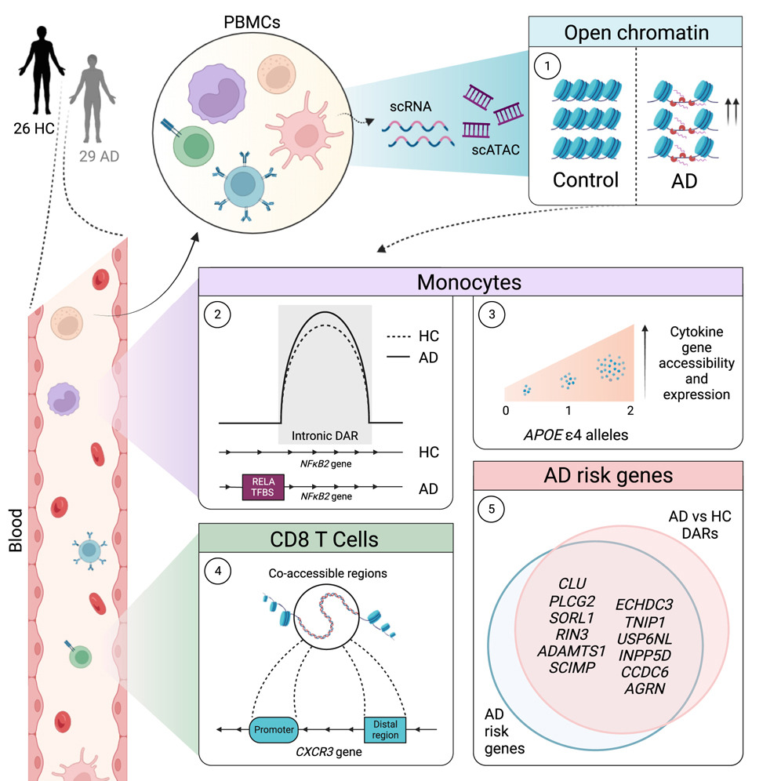

# BIOS784-Functional_Genomics

This is a repository of our group project from UNC BIOS/BCB784 Intro to Computational Biology course. 

For our project, we utilized pre-processed data from this paper https://doi.org/10.1016/j.neuron.2024.01.013. 

Specifically, we utilized Differentially Accesible Regions (DARs) and Diferentially Accessible Genes (DEGs) identified from 10X multiome single nucleus RNA and ATAC data of human PBMCs collected from healthy donors and donors with Alzheimers.

